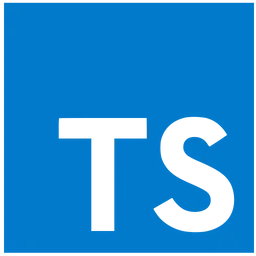

# **PRESENTACIÓN**

#### Sara Bulpe Martínez

---

# **ÍNDICE**

1. Modelos de Arquitectura web.
2. Mecanismos de Ejecución de Código en un Navegador Web.
3. Lenguajes de Programación en Entorno Cliente.
4. Ventajas de los lenguajes Script.
5. Desventajas de los lenguajes Script.
6. Tecnologías y Lenguajes Asociados. Integración del Código con las Etiquetas HTML.
7. Herramientas de Programación.

---

### **MODELOS DE ARQUITECTURA WEB**

- **Single Page Application (SPA)**
  - Una vez cargada no necesita navegar a otra web.
- **Arquitectura de Aplicaciones Web Progresivas (PWA)**
  - Basadas en las SPA pero con propiedades offline. Pueden instalarse en los dispositivos.
- **Arquitectura de Renderizado del Lado del Servidor (SSR)**
  - Las páginas web se renderizan en un servidor tras ser solicitadas por el usuario.

---

### **MODELOS DE ARQUITECTURA WEB**

- **Arquitectura Orientada al Servicio(SOA)**
  - Las aplicaciones se dividen en servicios y cada servicio representa una unidad funcional.
- **Arquitectura de Microservicios**
  - Los microservicios son componentes modulares que encajan entre sí, manteniendo cada componente pequeño y con contexto limitado.

---

### **MECANISMOS DE EJECUCIÓN DE CÓDIGO EN UN NAVEGADOR WEB**

- El motor de Javascript ejecuta el código de forma secuencial en cuanto se carga el navegador. Cada navegador tiene su propio motor.

  - **Google Chrome**: V8
  - **Safari**: JavaScriptCore
  - **Mozilla Firefox**: Spider Monkey
  - **Microsoft Edge**: Chakra

---

### **MECANISMOS DE EJECUCIÓN DE CÓDIGO EN UN NAVEGADOR WEB**

* La compatibilidad entre navegadores es la capacidad de hacer que la web funcione correctamente en cualquier navegador.


---

## **LENGUAJES DE PROGRAMACIÓN EN ENTORNO CLIENTE**

 ㅤㅤㅤ 

---

## **LENGUAJES DE PROGRAMACIÓN EN ENTORNO CLIENTE**

- **JavaScript**: Lenguaje principal. Permite crear webs interactivas y manipular el DOM. 
- **TypeScript**: Misma sintaxis que JavaScript pero siendo un lenguaje de alto tipado.
- **Python**: Normalmente se utiliza en servidor, pero se puede utilizar en el lado cliente mediante WebAssembly.

---

### **VENTAJAS DE LOS LENGUAJES SCRIPT**

- **VENTAJAS**
  - Sintaxis simple.
  - Requieren menos memoria.
  - Se integran fácilmente con otras tecnologías y aplicaciones.
  - Se pueden transferir de un OS a otro sin mucha dificultad.
  - Amplia disponibilidad de bibliotecas.
  - Permiten crear webs interactivas.

---

## **DESVENTAJAS DE LOS LENGUAJES SCRIPT**

- **DESVENTAJAS**
  - El intérprete es más lento que el compilador.
  - No son buenos para proyectos de software muy grandes y complejos.
  - Se requiere un intérprete o una máquina virtual específica para el lenguaje.

---

#### **TECNOLOGÍAS Y LENGUAJES ASOCIADOS, INTEGRACIÓN DEL CÓDIGO CON LAS ETIQUETAS HTML**

* Con el HTML podemos crear la estructura base de la página web, mientras con el CSS podemos dar forma y personalizar la misma. Usamos JavaScript para hacer dinámica e interactiva nuestra web.

* Podemos inyectarlo dentro de nuestro archivo html o añadirlo al final de nuestro código.

--- 

### **INTEGRACIÓN DEL CÓDIGO CON LAS ETIQUETAS HTML**
```html
<!DOCTYPE html>
<html lang="en">
<head>
    <meta charset="UTF-8">
    <meta name="viewport" content="width=device-width, initial-scale=1.0">
    <title>Document</title>
</head>
<body>
    <script>
        document.write("¡Hola, mundo!")
    </script>
</body>
<script src="js/myscript.js"></script>
</html>
```

---

## **HERRAMIENTAS DE PROGRAMACIÓN**

 ㅤㅤ 

---

### **HERRAMIENTAS DE PROGRAMACIÓN**

- **Visual Studio Code (VSCode)**: Es un editor de código fuente multiplataforma, de software libre y que puede utilizarse en diferentes SO.
- **Chrome DevTools**: Es una herramienta de desarrollo integrada en el navegador para diagnosticar errores o testear las modificaciones mínimas.
- **GIT**: Es un sistema de control de versiones distribuido, diseñado para la eficiencia, confiabilidad y compatibilidad de las diferentes versiones de una aplicación.

---

# **BIBLIOGRAFÍA**

- https://rockcontent.com/es/blog/arquitectura-web/#:~:text=La%20arquitectura%20web%20es%20la,medio%20para%20ejecutar%20su%20trabajo.

- https://kinsta.com/es/blog/arquitectura-aplicaciones-web/

- https://colorlib.com/wp/spa-websites/

- https://www.simicart.com/blog/progressive-web-apps-examples/


---

# **BIBLIOGRAFÍA**

- https://revistacloud.com/ejemplos-de-arquitectura-soa/

- https://openwebinars.net/blog/microservicios-que-son/

- https://www.atatus.com/blog/how-does-javascript-works/#:~:text=The%20JavaScript%20engine%20runs%20each,then%20run%20on%20the%20browser.

- https://openwebinars.net/blog/que-es-ecmascript/

---

# **BIBLIOGRAFÍA**

- https://www.etnassoft.com/2011/05/31/comparativa-entre-los-distintos-motores-ecmascript/

- https://es.wikipedia.org/wiki/JavaScriptCore

- https://en.wikipedia.org/wiki/Cross-browser_compatibility

- https://www.freecodecamp.org/espanol/news/ventajas-y-desventajas-de-javascript/

---

# **BIBLIOGRAFÍA**

- https://blog.hubspot.es/website/ventajas-y-desventajas-de-javascript#ventajas

- https://www.codesdope.com/blog/article/scripting-language/

- https://es.wikipedia.org/wiki/HTML

- https://es.wikipedia.org/wiki/CSS

- https://openwebinars.net/blog/que-es-visual-studio-code-y-que-ventajas-ofrece/

---

# **BIBLIOGRAFÍA**

- https://blog.ida.cl/desarrollo/conoce-los-principales-aspectos-chrome-devtools/

- https://es.wikipedia.org/wiki/Git

- https://www.atlassian.com/es/git/tutorials/why-git#:~:text=Una%20de%20las%20mayores%20ventajas,entre%20muchos%20usuarios%20de%20Git.